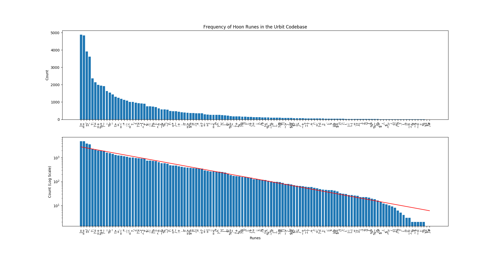

# runecount
Count runes in Hoon code (the Urbit codebase).

This is an oversimplified view of which runes are commonly used in actual Hoon.  Notably, this largely ignores irregular forms and doesn't look at the parse tree at all yet.

